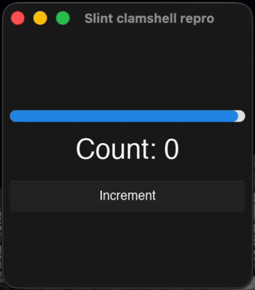
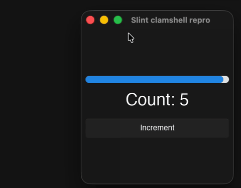

# Slint 1.16 macOS clamshell repro

Minimal reproducer for a Slint 1.16 rendering regression on macOS when the
MacBook lid is closed (clamshell mode with an external display). Slint 1.15
does not have this problem.

**Lid open — works correctly:** the sweep bar animates; clicking the
button immediately updates the counter.



**Lid closed — broken:** no frame ever repaints, so the sweep bar is
frozen and the counter appears not to update, even though clicks are
being received (see "What I see that points at a specific mechanism"
below).



The UI is a continuously-sweeping progress bar, a counter, and an "Increment"
button. Under normal conditions the bar sweeps smoothly and pressing
the button immediately updates the counter. When the bug is active, the
bar stops sweeping and the counter appears not to change — even though
clicks are still being received and the value is actually incrementing
under the hood (see "What I see" below for what gives that away).

## Setup

- MacBook (Apple Silicon, macOS 14+)
- External display connected
- External keyboard and mouse (required to operate the Mac with the lid
  closed)

## Build & run

```
cargo run --release
```

Pin to `=1.16.0` on `slint` and `slint-build` is deliberate so the repro is
unambiguous. Change both to `=1.15.0` in `Cargo.toml` and rebuild
(`cargo clean && cargo run --release`) to observe that 1.15 is unaffected.

## Reproducing

### Case 1 — start with the lid already closed

1. Close the MacBook lid (standard clamshell setup).
2. `cargo run --release`
3. The window opens on the external display. **Symptom:** the sweep bar
   is frozen from the first frame. Pressing the Increment button
   does not appear to do anything visually — the counter does not update
   on screen.

### Case 2 — close the lid mid-session

1. With the lid open, `cargo run --release`. The bar sweeps; the
   counter updates on click.
2. Drag the window to the external display. Still works — bar still
   sweeps, counter still updates.
3. Close the MacBook lid.
4. **Symptom:** the bar freezes. Clicking the button does not appear
   to update the counter.

### Case 3 — lid open the whole time

Works correctly throughout. Included as the control case.

## What I see that points at a specific mechanism

The "stuck" state isn't actually stuck — it's visually stuck. Observed in
Case 2 above:

- While stuck, click the Increment button several times. Counter appears
  not to change.
- Drag the window between displays (or resize the window). The redraw
  that fires on display change / resize paints *one* frame, and the
  counter jumps to the accumulated value reflecting every click that
  happened while "stuck."
- Then the bar and counter freeze again until the next window/display
  event.

Input, state updates, and the Slint event loop are all working. What's
broken is the path that drives repaints between discrete winit events —
which in Slint 1.16 is the new CADisplayLink-based frame throttle.

Local instrumentation (adding logs to `tick:`, `request_throttled_redraw`,
and the display-reconfiguration observer in
`internal/backends/winit/frame_throttle/macos_display_link.rs`) confirmed
that in the failing scenarios, `request_throttled_redraw` is called
(Slint is asking for frames) but `tick:` is never invoked — the
CADisplayLink is not firing at all.

The CADisplayLink is created via
`[CADisplayLink displayLinkWithTarget:selector:]`, the iOS/tvOS
class-method factory. In local testing, switching the factory to
`-[NSScreen displayLinkWithTarget:selector:]` (macOS 14+) and observing
`NSApplicationDidChangeScreenParametersNotification` to rebind the link on
display reconfiguration resolves all three scenarios above.
